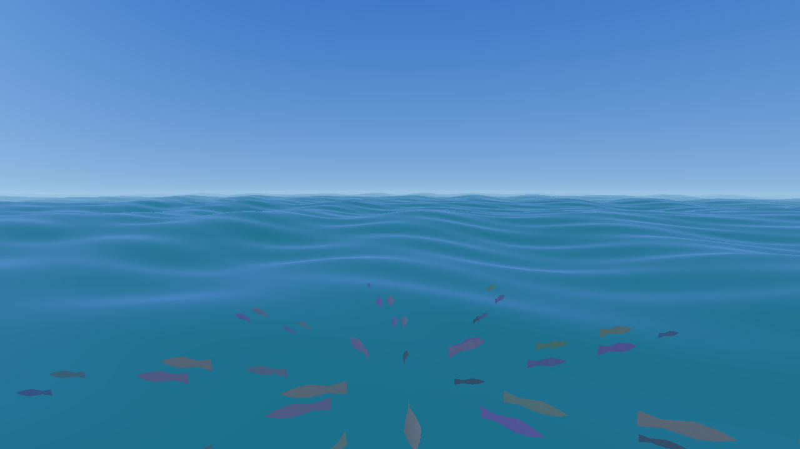

# Ocean 3D

Océano OpenGL en C++ — un solo archivo, sin dependencias más allá de GLFW + OpenGL 3.3.

> **Concepto de prueba**: proyecto creado para verificar si un modelo de lenguaje
> local (**Qwen3.8-27B**, GGUF `UD-IQ4_XS`, llama.cpp en GPU) puede producir
> código C++/OpenGL funcional y completo — shaders, cámara libre, simulación
> de cardume, verificación headless.

## Qué hay

- Océano infinito con **5 olas de Gerstner** (displacement en vertex shader,
  normales analíticas en fragment shader). El grid sigue a la cámara (enteros
  XZ) → sensación de infinito sin upload por frame.
- **Cardume de 48 peces** low-poly en órbita 26 m adelante de la cámara,
  ~4 m bajo la superficie. Repulsión radial al acercarse la cámara
  (radio 12 m, fuerza ∝ (1−d/R)², pico 24 m/s², tope 14 m/s).
  Tail-wag 3× más rápido huyendo.
- Sky con sol, niebla de profundidad, tinte de profundidad en los peces.



## Build

```bash
# Dependencias: libglfw-dev, zlib (en CachyOS/Arch: pacman -S glfw zlib)
g++ -O2 -std=c++17 src/ocean.cpp -o ocean $(pkg-config --cflags --libs glfw3) -lz
```

## Run

```bash
./ocean                                   # ventana interactiva
./ocean --screenshot --time 2.0           # screenshot headless (GPU)
LIBGL_ALWAYS_SOFTWARE=1 ./ocean --screenshot --time 2.0   # sin GPU (llvmpipe)
```

## Controles

| Tecla / mouse | Acción |
|---|---|
| W A S D | Adelante / atrás / strafe |
| Q / E | Bajar / subir |
| Shift | Boost ×3 |
| Mouse izq. | Rotar cámara (look) |
| Mouse der. | Pan |
| Rueda | Velocidad de movimiento |
| R | Reset de cámara |
| ESC | Salir |
| [ / ] | Velocidad de nado de los peces (0.4–8 m/s) |
| Y / T | Profundidad del cardume (1–10 m) |

## Hardware de desarrollo

| Componente | Detalle |
|---|---|
| SO | CachyOS Linux (kernel `bore`) |
| CPU | AMD Ryzen 7 7800X3D |
| RAM | 32 GB |
| GPU | AMD Radeon RX 7900 XT (20 GB VRAM) |
| Modelo local | Qwen3.8-27B GGUF `UD-IQ4_XS` (llama.cpp, GPU) |

## Bugs de Mesa documentados

Se documentaron dos bugs de Mesa 26.2.2 (CachyOS, kernel 7.2.x) y sus
workarounds en [`NOTES.md`](NOTES.md):

1. `glVertexAttribPointer` contra el VAO por defecto → `GL_INVALID_OPERATION`
   → fix: VAOs explícitos.
2. `glEnable(GL_BLEND)` / `glDisable(GL_BLEND)` → `GL_INVALID_OPERATION`
   en todos los perfiles/drivers → workaround: peces opacos + depth test OFF.

## Archivos

```
ocean-3d/
├── src/ocean.cpp      # Programa completo (GL 3.3, loader runtime, PNG writer)
├── ocean.png          # Screenshot (GPU)
├── cardume.gif        # Demo 4 frames de la huida
├── verify_fish.py     # Detector de clusters de peces en screenshots
├── CHANGELOG.md       # Historia completa
└── NOTES.md           # Estado actual + bugs documentados
```

## License

GPL-3.0 — ver [LICENSE](LICENSE).
